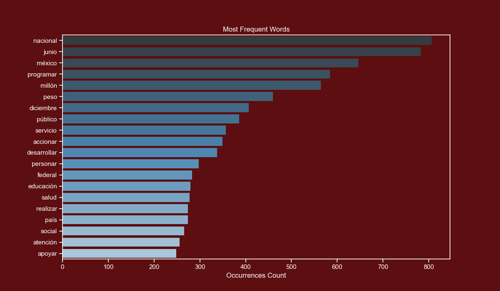
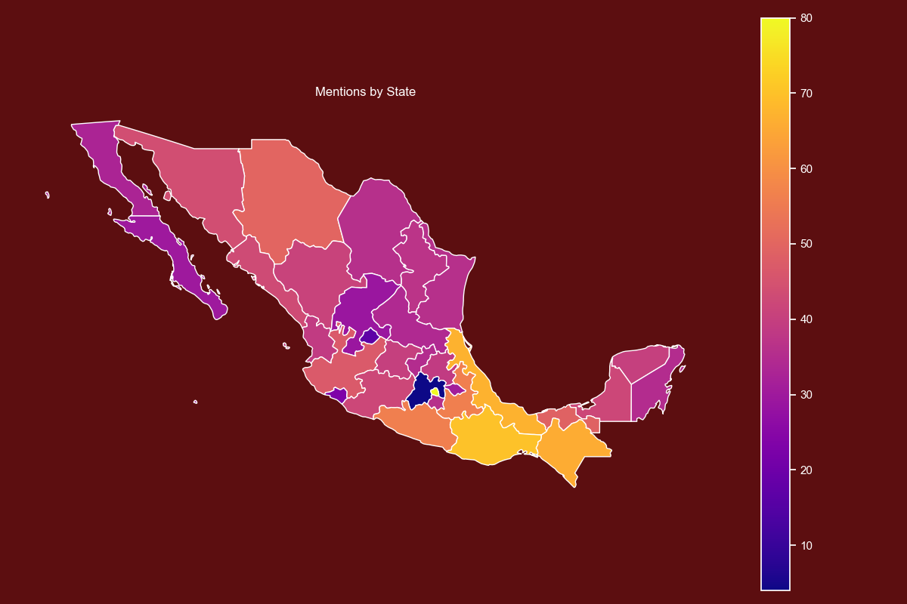
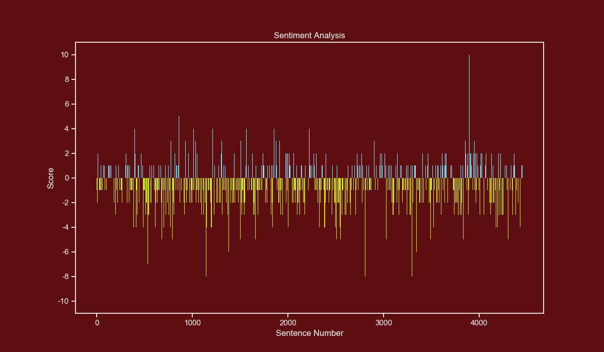

# Mexican Government Report Text Analysis

In this repository, I will document the complete process of extracting text from a PDF file, cleaning it, passing it through an `NLP` pipeline and presenting the results with graphs and plots.

The PDF file is quite special, it is the government report of 2019, which was released the 1st of September. This PDF file can be found in the data folder.

## Requirements

This project uses the following Python libraries

* `PyPDF2` : For extracting text from PDF files.
* `spaCy` : For passing the extracted text into an NLP pipeline.
* `NumPy` : For fast matrix operations.
* `pandas` : For analysing and getting insights from datasets.
* `matplotlib` : For creating graphs and plots.
* `seaborn` : For enhancing the style of matplotlib plots.
* `geopandas` : For plotting maps.

If you are on Windows I strongly recommend that you use `Anaconda` and install `geopandas` using these commands:

```
conda install -c conda-forge geopandas
conda install -c conda-forge descartes
```

## PDF Extraction

The government report that we will process can be downloaded from the following url: https://www.gob.mx/primerinforme

For your convenience I have added the PDF file in the data folder.

Extracting text from PDF files is a bit unreliable, you lose the original formatting and there are times you don't get any text at all.

Fortunately, this PDF file is simple enough that extracting the text wasn't that complex but I encountered some challenges that I will go in more detail in this section.

For this task, we will use `PyPDF2` which is a well-known PDF library.

```python
reader = PyPDF2.PdfFileReader("informe.pdf")
full_text = ""
```

The page numbers in the PDF are not the same as the reported number of pages, we use this variable to keep track of both.

```python
pdf_page_number = 3
```

We will only retrieve the first 3 sections of the government report which are between pages 14 and 326. The reason for this is that only the 3 first sections contain a substantial amount of text.

```python
for i in range(14, 327):
    # This block is used to remove the page number at the start of
    # each page. The first if removes page numbers with one digit.
    # The second if removes page numbers with 2 digits and the else
    # statement removes page numbers with 3 digits.
    if pdf_page_number <= 9:
        page_text = reader.getPage(i).extractText().strip()[1:]
    elif pdf_page_number >= 10 and pdf_page_number <= 99:
        page_text = reader.getPage(i).extractText().strip()[2:]
    else:
        page_text = reader.getPage(i).extractText().strip()[3:]

    full_text += page_text.replace("\n", "")
    pdf_page_number += 1
```

The previous code block ensures that we get the cleanest possible output. It removes page numbers and builds us the full transcript to a single string.

There's a small issue when decoding the PDF file. We will manually fix all the weird characters with their correct equivalents.

```python
for item, replacement in CHARACTERS.items():
    full_text = full_text.replace(item, replacement)
```

This actually took a few hours to complete, I had to manually map all weird characters with their correct equivalents, some examples are:

```python
CHARACTERS = {
    "ç": "Á",
    "⁄": "á",
    "…": "É",
    "”": "é",
    "ê": "Í",
    "™": 'í',
    "î": "Ó"
}
```

We will remove all extra white spaces and finally we save the cleaned text into a .txt file.

```python
# This looks weird but that's the most practical way to remove double to quad white spaces.
full_text = full_text.replace("  ", " ").replace(
    "  ", " ").replace("  ", " ")

with open("transcript_clean.txt", "w", encoding="utf-8") as temp_file:
    temp_file.write(full_text)
```

With the transcript cleaned and well encoded we are ready to run it through a `NLP` pipeline.

## NLP Pipeline

For this step we will make use of `spaCy`, this library is very well built and easy to use.

After installing it with `pip` you must install the Spanish model. You can do it by running the following command on your CMD or Terminal:

`python -m spacy download es_core_news_md`

At this point I made the decision to save the pipeline results to csv files. This way the csv files can be loaded into any statistical toolkit.

We start by preparing our `corpus` and loading the Spanish model.

```python
corpus = open("transcript_clean.txt", "r", encoding="utf-8").read()
nlp = spacy.load("es_core_news_md")

# Our corpus is bigger than the default limit, we will set
# a new limit equal to its length.
nlp.max_length = len(corpus)

doc = nlp(corpus)
```

*Note: This script takes a few minutes to complete, you will also need a few gigabytes of RAM to properly run it, feel free to skip it and use the csv files in the data folder.*

Once everything is loaded, we will just save the results into csv files.

### Text Tokens

The code is pretty straight forward, we initialize a list with a header row.

Then we iterate over the `doc` object and add the token text, lemma, part-of-speech and other properties to our data list and save it to csv using `csv.writer()`.

```python
data_list = [["text", "text_lower", "lemma", "lemma_lower",
                "part_of_speech", "is_alphabet", "is_stopword"]]

for token in doc:
    data_list.append([token.text, token.lower_, token.lemma_, token.lemma_.lower(), token.pos_, token.is_alpha, token.is_stop])

csv.writer(open("./tokens.csv", "w", encoding="utf-8",
                newline="")).writerows(data_list)
```

It is important to note that a `token` is not always a word, it can be a punctuation mark or a number. That's why we also save the `is_alpha` property so we can later filter out non-alphabetic tokens.

We also saved the lowercase form of all tokens and lemmas so we don't have to do it every time we want to process them with `pandas`.

### Text Entities

This is almost the same as the previous code block, the main difference is that we iterate over the `doc.ents` object.

```python
data_list = [["text", "text_lower", "label"]]

for ent in doc.ents:
    data_list.append([ent.text, ent.lower_, ent.label_])

csv.writer(open("./entities.csv", "w", encoding="utf-8",
                newline="")).writerows(data_list)
```

Entities refer to real world persons, organizations or locations. Since the model was trained from `Wikipedia` we will get a broad amount of them.

### Text Sentences

This function is a bit different than the previous ones, in this part I counted the number of positive and negative words per sentence.

I used the following dataset of positive and negative words:

https://www.kaggle.com/rtatman/sentiment-lexicons-for-81-languages

To download it you will require to register to Kaggle (free). And from the zip file you will require 2 txt files:

```
negative_words_es.txt
positive_words_es.txt
```

Once you have the required files in your workspace we will load them into memory and turn their contents into lists.


```python
with open("positive_words_es.txt", "r", encoding="utf-8") as temp_file:
    positive_words = temp_file.read().splitlines()

with open("negative_words_es.txt", "r", encoding="utf-8") as temp_file:
    negative_words = temp_file.read().splitlines()
```

Now we will iterate over the` doc.sents` object and keep a score for each sentence and save the results to csv.

```python
data_list = [["text", "score"]]

for sent in doc.sents:

    # Only take into account real sentences.
    if len(sent.text) > 10:

        score = 0

        # Start scoring the sentence.
        for word in sent:

            if word.lower_ in positive_words:
                score += 1

            if word.lower_ in negative_words:
                score -= 1

        data_list.append([sent.text, score])

csv.writer(open("./sentences.csv", "w", encoding="utf-8",
                newline="")).writerows(data_list)
```

After running the 3 functions we will have 3 csv files ready to be analyzed with `pandas` and plotted with `matplotlib`.

## Plotting the Data

For creating the plots we will use `seaborn` and `matplotlib`, the reason for this is that `seaborn` applies some subtle yet nice looking effects to the plots.

In this project we are going to use bar plots (1 horizontal and 1 vertical) which are very helpful for comparing different values of the same category.

To plot the map we will use `geopandas` and a shape file of México.

The first thing to do is to set some custom colors that will apply globally to each plot.

```python
sns.set(style="ticks",
    rc={
        "figure.figsize": [12, 7],
        "text.color": "white",
        "axes.labelcolor": "white",
        "axes.edgecolor": "white",
        "xtick.color": "white",
        "ytick.color": "white",
        "axes.facecolor": "#5C0E10",
        "figure.facecolor": "#5C0E10"}
    )
```

With our style declared we are ready to plot our data.

### Most Used Words

We will start by loading the tokens csv file into a `DataFrame`.

```python
df = pd.read_csv("./data/tokens.csv")
```

There's a small issue with the lemma of *programas* (programs), we fix it by grouping together *programa* and *programar*.

```python
df.loc[df["lemma_lower"] == "programa", "lemma_lower"] = "programar"
```

We will only take into account the top 20 alphabet tokens that are longer than 1 character and are not stop words.

```python
words = df[(df["is_alphabet"] == True) & (df["is_stopword"] == False) & (
    df["lemma_lower"].str.len() > 1)]["lemma_lower"].value_counts()[:20]
```

We will use a `seaborn` barplot, which allows us to apply a gradient to the color values without any effort.

```python
sns.barplot(x=words.values, y=words.index, palette="Blues_d", linewidth=0)
```

We add the final customizations.

```python
plt.xlabel("Ocurrences Count")
plt.title("Most Frequent Words")
plt.show()
```



In the table below I have added the lemmas, their counts and their closest English equivalents.

| Lemma (Spanish) | Lemma (English) | Total Count |
| --- | ---- | --- |
| nacional | national | 806 |
| junio | June | 783 |
| méxico | Mexico | 646 |
| programar | program | 584 |
| millón | million | 564 |
| peso | Mexican Peso | 460 |
| diciembre | December | 407 |
| público | public (population) | 386 |
| servicio | service | 357 |
| accionar | action | 349 |
| desarrollar | develop | 338 |
| personar | people | 298 |
| federal | federal (government) | 283 |
| educación | education | 279 |
| salud | health | 278 |
| realizar | perform | 274 |
| país | country | 274 |
| social | social (programs) | 266 |
| atención | aid | 256 |
| apoyar | support | 248 |

### Mentions per State

If you are on Windows you will require to use `Anaconda` which is a `Python` distribution that comes bundled with hundreds of data science oriented libraries.

After you install `Anaconda` you will require to install 2 packages, you can do this by running these commands on your CMD or Terminal.

```
conda install -c conda-forge geopandas
conda install -c conda-forge descartes
```

Don't try to use `pip install geopandas` on Windows, it won't work. It will work well on Linux and macOS though.

After you have `geopandas` installed you will require a shape file of Mexico, you can download it from the following link:

https://www.arcgis.com/home/item.html?id=ac9041c51b5c49c683fbfec61dc03ba8

You will require to unzip the file and rename the folder to `mexicostates`. This folder contains various files, some with metadata and others with coordinates.

We start by loading the entities csv file and loading the shape file.

```python
df = pd.read_csv("./data/entities.csv")
mexico_df = geopandas.read_file("./mexicostates")
```

The shape file is loaded as a folder instead of an specific file.

Now we will iterate over all our states, but there are some details. The shape file contains the state names without accent marks and uses the old name of Ciudad de México (it was named Distrito Federal).

Before modifying the shape file `DataFrame` we 'clean' the state name so they can be matched.

```python
for state in STATES:

    # We remove accent marks and rename Ciudad de Mexico to its former name.
    clean_name = clean_word(state)

    if clean_name == "Ciudad de Mexico":
        clean_name = "Distrito Federal"
    elif clean_name == "Estado de Mexico":
        clean_name = "Mexico"

    # We insert the count value into the row with the matching ADMIN_NAME (state name).
    mexico_df.loc[mexico_df["ADMIN_NAME"] == clean_name,
                    "count"] = len(df[df["text_lower"] == state.lower()])
```

The shape file `DataFrame` now has a new column with the counts of each state.

We use the plot method of the `DataFrame` and specify the column name, the color map and enable the legend.

```python
mexico_df.plot(column="count", cmap="plasma", legend=True)
```

We add the final customizations.

```python
plt.title("Mentions by State")
plt.axis("off")
plt.tight_layout()
plt.show()
```



### Sentiment Analysis

For the sentiment analysis I used the lexicon-based method, which consists in counting positive and negative words per sentence.

This method has a few considerations, the most important is that it doesn't know the context of the sentence, so sentences like `Reduced the crime levels by 10%.` will be considered as negative.

The only way around this is to train a model and use `Machine Learning` to evaluate the sentences with it.

Unfortunately, this is a time-consuming task and we will have to use the other method.

The first thing to do is to load the sentences csv file and only take into account scores between -10 and 10. There were very few cases where the score goes beyond those boundaries.

```python
df = pd.read_csv("./data/sentences.csv")
df = df[(df["score"] <= 10) & (df["score"] >= -10)]
```

We will make bars with a score below zero yellow and bars with a score above zero blue, to do this we first create an `Array` with the same length as our `Dataframe`.

Each element of the `Array` is a tuple of 3 decimal values representing an RGB color.

```python
colors = np.array([(0.811, 0.913, 0.145)]*len(df["score"]))
```

Now we use a boolean mask and set different RGB values where the score is equal or higher than zero.

```python
colors[df["score"] >= 0] = (0.529, 0.870, 0.972)
```

Now we use a bar plot and pass the x, y and the previously calculated colors.

```python
plt.bar(df.index, df["score"], color=colors, linewidth=0)
```

We set our yticks in steps of 2, from -10 to 10.

```python
yticks_labels = ["{}".format(int(i)) for i in np.arange(-12, 12, 2)]
plt.yticks(np.arange(-12, 12, 2), yticks_labels)
```

We add the final customizations.

```python
plt.xlabel("Sentence Number")
plt.ylabel("Score")
plt.title("Sentiment Analysis")
plt.show()
```



## Conclusion

In previous projects, I have used some `NLP`  workflows, such as tokenizing words and sentences, but this time I wanted to do something a bit more complex.

I learned several new things and their best practices. This new knowledge will come in handy for future projects.

The next steps are to build a `Machine Learning` model for sentiment analysis and evaluate next year's report with it.

[](https://www.patreon.com/bePatron?u=20521425)